# opentui-web browser-compatibility audit

**Audited ref:** `washe/hack/07` (`f432616`) — the fully-patched tip that
downstream embedders vendor (audit the store shelf, not the museum copy).
**Date:** 2026-07-28. **Support data:** generated from
`@mdn/browser-compat-data` **8.0.8** (the pinned version in
[`package.json`](./package.json) is this audit's data snapshot) by
[`gen-data.mjs`](./gen-data.mjs); humans curate only what machines cannot
know — tiers, hazard grades, interop notes, fleet guidance — in
[`features.mjs`](./features.mjs). Usage facts come from
[`scan.mjs`](./scan.mjs) (`usage.json`); grids are rendered by
[`render-svg.mjs`](./render-svg.mjs). Method: [README.md](./README.md).

**Structural context (stated once, plainly).** On iOS, every browser is
WebKit: Apple requires App Store browsers to use the system engine (limited
EU alternative-engine carve-outs exist since iOS 17.4 under the DMA, with
negligible adoption to date). "iOS Safari" columns therefore govern
Chrome-on-iOS, Firefox-on-iOS, and every other iOS browser. WebKit coverage
is consequently **population-shaped, not version-shaped**: a WebKit
divergence reaches every iOS user regardless of which browser they chose,
so WebKit verification is not optional for any Tier-A surface.

**Tiers.** A = production-critical (`packages/opentui-browser` — what
embedders ship). B = demo/site surface (`packages/web-demo`). C = core
library paths reachable from a browser build.

**Primary-embedder fact (severity calibration depends on it):** the known
primary embedder constructs the **2D `CanvasPainter`** as its default
(`canvas-host.tsx:33,169`); the WebGL2/WebGPU painters are non-default
paths there.

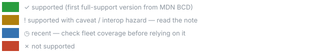

The audit's organizing distinction: **"supported everywhere" is not
"interoperable everywhere."** Amber rows are green-by-version and still
produce different pixels per engine — they are where cross-engine defects
come from, and a Chromium-only test rig cannot see them (finding F1).

## Severity rubric

Severity = **tier reach** × **visual severity** × **affected fleet**.

| Axis | 3 | 2 | 1 |
|---|---|---|---|
| Tier reach | A, default path | A, non-default path | B/C |
| Visual severity | text corrupted/illegible | visible mispaint | ≤1px drift |
| Affected fleet | all of an engine's users | engine subset (version floor) | rare states (zoom mid-session, ESR) |

High ≥ 7 · Medium 5–6 · Low ≤ 4. The next auditor inherits the
calibration, not the conclusions.

## Painter impact

The painter dimension does **not** partition cleanly, and the shape of the
overlap is itself a finding: only the WebGL2 and WebGPU rows are exclusive
to their painters — every other Tier-A row is shared by **all three**,
because the GL and GPU painters rasterize their glyph atlases *through 2D
contexts* (`canvas-gl-painter.ts:190,205`, `canvas-gpu-painter.ts:216,242`).
Canvas2D text rasterization is the hub every painter draws through; the
accelerated painters don't escape the 2D interop hazards, they import them
(finding F3). Generated by [`painter-matrix.mjs`](./painter-matrix.mjs)
from the `painters` facet in `features.mjs`:

| API | grade | Canvas2D | WebGL2 | WebGPU | painter-independent | demo tier | resolution |
|---|---|---|---|---|---|---|---|
| Canvas 2D text | ✓ | ● | ● | ● |   |   | — |
| textBaseline: 'top' | ⚠ | ● | ● | ● |   |   | fix in flight (F2, F3) — issues/05, issues/01, issues/04 |
| TextMetrics actualBoundingBox{Ascent,Descent,Left,Right} | ✓ | ● | ● | ● |   |   | is the mitigation |
| TextMetrics fontBoundingBox{Ascent,Descent} — deliberately unused | ⚠ | ● | ● | ● |   |   | policy guard |
| measureText | ⚠ | ● | ● | ● |   |   | accepted risk (owner signed off) (F4) |
| WebGL2 | ⚠ |   | ● |   |   |   | issue filed — charlie.dev#447, issues/01 |
| WebGPU | ◷ |   |   | ● |   |   | issue filed (F5) — charlie.dev#448, issues/03 |
| WebAssembly.instantiateStreaming | ✓ |   |   |   | ● |   | — |
| TextEncoder / TextDecoder | ✓ |   |   |   | ● |   | — |
| window.devicePixelRatio | ⚠ | ● | ● | ● |   |   | issue drafted (F6) — issues/06 |
| Canvas colorSpace / display-P3 — unused, unmanaged | ✗ | ● | ● | ● |   |   | issue filed — charlie.dev#446 |
| Workers with { type: 'module' } | ⚠ |   |   |   |   | ● | risk — owner ruling pending |
| ResizeObserver | ✓ |   |   |   |   | ● | — |
| CSS dynamic viewport units | ⚠ |   |   |   |   | ● | risk — owner ruling pending |
| tree-sitter WASM grammars over fetch + classic Worker | ✓ |   |   |   | ● |   | — |

**Quick reads per embedder profile:**

- **Canvas2D-only** (the known primary embedder today): 7 Tier-A rows
  apply, 5 of them hazards — dropping exactly the WebGL2/WebGPU rows and,
  in the findings, F5 entirely plus the GL/GPU halves of F3 and F6.
  Every amber text-metrics hazard remains: the 2D painter IS the hub.
- **WebGL2 or WebGPU embedders:** 8 rows each (1 exclusive), 6 hazards —
  a strict superset of the Canvas2D hazard set plus their context's own
  floor/availability row. Findings by painter: F2 (2d), F3 (gl+gpu),
  F5 (gpu), F6 (gl+gpu), F1/F4/F7 (all painters).

Regenerate the table after any facet change:
`node audit/painter-matrix.mjs`.

---

## Tier A — production-critical (`opentui-browser`)

### Canvas 2D text pipeline

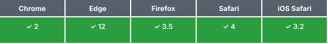

Baseline: Widely available · [caniuse](https://caniuse.com/canvas-text)

Drawing surface for the 2D painter and the glyph atlases of the GL/GPU
painters. No version risk.

### `textBaseline: 'top'` anchoring

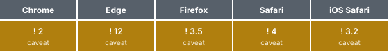

Baseline: Widely available · [caniuse](https://caniuse.com/mdn-api_canvasrenderingcontext2d_textbaseline)

**Interop hazard.** All painters place glyphs (and derived decorations) at
offsets from the `'top'` anchor, but the anchor→alphabetic-baseline
distance derives from font ascent metrics the spec does not pin to
specific font tables — engines derive different ascents for the same font,
so any *absolute* offset constant is engine-dependent. Evidence: WPT
[interop#159](https://github.com/web-platform-tests/interop/issues/159) /
[interop#427](https://github.com/web-platform-tests/interop/issues/427)
(both declined), [whatwg/html#6731](https://github.com/whatwg/html/issues/6731).
**Fleet:** 100% of WebKit traffic — on iOS, every browser (see the
structural note). Findings **F2/F3**.

### TextMetrics `actualBoundingBox*`

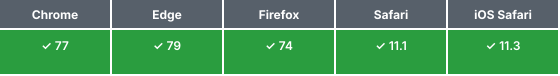

Baseline: Widely available · [caniuse](https://caniuse.com/mdn-api_textmetrics_actualboundingboxascent)

Per-engine rasterizer truth — the correct tool for **self-calibration**
(measure where *this* engine puts the baseline; place decorations relative
to that), with ±1px cross-engine rounding variance
([Mozilla 1801198](https://bugzilla.mozilla.org/show_bug.cgi?id=1801198)).
Wrong tool for cross-engine pixel identity. This is the remediation seam
for F2/F3.

### TextMetrics `fontBoundingBox*` — *deliberately unused*

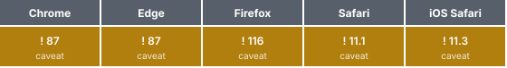

Baseline: Widely available (2023-08) · [caniuse](https://caniuse.com/mdn-api_textmetrics_fontboundingboxascent)

The tempting wrong tool: three engines return three different value sets
for the same font ([interop#427](https://github.com/web-platform-tests/interop/issues/427):
"you have to pick one browser to display it right"). Policy row: do not
adopt for layout math.

### `measureText().width` cell sizing

Baseline: Widely available · [caniuse](https://caniuse.com/canvas-text)

**Interop hazard.** Advance width of `'M'` differs sub-pixel per
engine/rasterizer → rounded cell width, and column count at a given
viewport, can differ by one across engines. `fit()` floors cols/rows,
which contains it. Finding **F4** (documented divergence — accepted risk).

### WebGL2 glyph-atlas painter

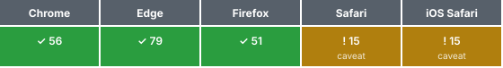

Baseline: Widely available · [caniuse](https://caniuse.com/webgl2)

Safari's floor is 15 (2021); older WebKit returns `null`
(`canvas-gl-painter.ts:122`). Context attrs `{ alpha:false,
antialias:false, premultipliedAlpha:false }` plus
`texImage2D`-from-canvas (`:225`) touch areas with WebKit-specific
histories (premultiplication, canvas color management). **Fleet:**
pre-iOS-15 tail is small and shrinking — re-check the iOS version split at
each audit. Finding **F3**.

### WebGPU painter

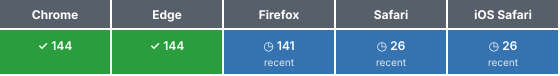

Baseline: Newly available · [caniuse](https://caniuse.com/webgpu)

Chromium-stable since 113 (BCD's full-support line is 144; the delta is
platform caveats), **recent** elsewhere: Safari 26 (2025), Firefox 141+
(initially Windows). `canvas-gpu-painter.ts:123` **throws** when
`navigator.gpu` is absent — the embedder owns the gpu→gl→2d chain.
**Fleet:** the sub-26 iOS tail is the at-risk population for any embedder
defaulting to this painter; measure via caniuse usage-relative mode before
promoting it. Finding **F5**.

### WebAssembly (`instantiateStreaming` + fallback)

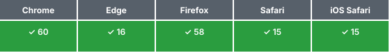

Baseline: Widely available · [caniuse](https://caniuse.com/wasm)

`wasm.ts:82-87` holds the resilient pattern: streaming first (requires
`application/wasm` MIME — the classic breakage), `ArrayBuffer` fallback.
Keep the fallback; hosting configs regress.

### TextEncoder / TextDecoder

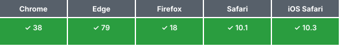

Baseline: Widely available · [caniuse](https://caniuse.com/textencoder)

Universal. `ansi.ts:10`, `buffer.ts:12`, `edit-buffer.ts:8`.

### `devicePixelRatio` backing-store scaling

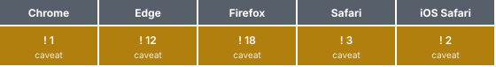

Baseline: Widely available · [caniuse](https://caniuse.com/mdn-api_window_devicepixelratio)

The hazard is fractional DPR (zoom, Windows scale). The 2D painter derives
its transform from measured device pixels — the right shape. GL/GPU
painters snapshot DPR at init. Finding **F6**.

### Canvas `colorSpace` / display-P3 — *absence, verified*

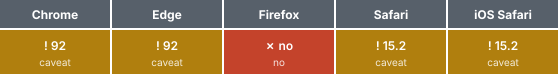

Baseline: not Baseline (Firefox has never shipped it) · [caniuse](https://caniuse.com/mdn-api_htmlcanvaselement_getcontext_2d_context_colorspace)

The painters never pass `colorSpace` (identifier-level sweep: zero
mentions), so every canvas is sRGB — and on wide-gamut panels (all current
iPhones, most Macs) each ENGINE decides how sRGB canvas maps to the P3
display. Color-critical output can render measurably differently per
engine/OS, and Firefox's non-support forecloses a uniform P3 upgrade path
today. Owner ruling 2026-07-29: not accepted as-is — tracked as
[charlie.dev#446](https://github.com/indexzero/charlie.dev/issues/446)
(measure sRGB-on-P3 divergence via a painter swatch check, then decide
display-p3 adoption). **Fleet:** wide-gamut is the majority of
Apple-device traffic.

---

## Tier B — demo/site surface (`web-demo`)

### Module workers

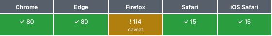

Baseline: Widely available (2023) · [caniuse](https://caniuse.com/mdn-api_worker_worker_ecmascript_modules)

Firefox only since 114 (mid-2023). **Fleet:** ESR stragglers; negligible.
Needs a fallback only if promoted to Tier A.

### ResizeObserver

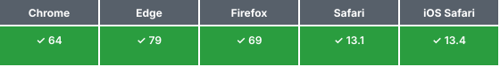

Baseline: Widely available · [caniuse](https://caniuse.com/resizeobserver)

No current risk.

### CSS dynamic viewport units (`dvh`)

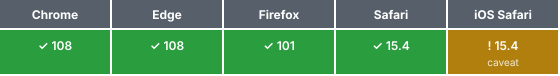

Baseline: Widely available · [caniuse](https://caniuse.com/viewport-unit-variants)

Supported everywhere current; iOS URL-bar collapse timing changes when
`dv*` values settle — a device-class behavior, not a support gap.

---

## Tier C — core library, browser-reachable

### tree-sitter WASM grammars (fetch + classic Worker)

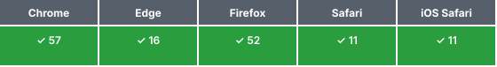

Baseline: Widely available · [caniuse](https://caniuse.com/wasm)

`core/src/lib/tree-sitter/client.ts:107` — classic worker, broad support;
grammar downloads are cross-origin fetches (CORS/MIME constraints).

---

## Notable absences (verified by the identifier-level sweep)

The absence sweep counts **every** textual mention — comments, types,
strings — across the tree (see `scan.mjs` `ABSENCE_PROBES` and the
epistemics note below).

- **OffscreenCanvas** — zero mentions. Worker rendering snapshots the cell
  grid to the main thread instead. Adoption would move the floor to
  Safari 16.4 / Firefox 105 — re-evaluate each audit.
- **FontFace API / `document.fonts`** — zero mentions in the library.
  `measureCell()` measures whatever font is active at construction;
  engines differ in fallback-font metrics (finding **F7**). The primary
  embedder gates fonts host-side before constructing the painter.
- **SharedArrayBuffer / Atomics** — two mentions, both type-level
  (`bun-ffi-structs/types.d.ts:230-231`); no runtime use. Future adoption
  drags in COOP/COEP.
- **Canvas `colorSpace`** — zero mentions; promoted to a Tier-A row above
  because the *absence itself* is the compat posture.

## What the scanner can and cannot prove (epistemics)

`scan.mjs` is line-oriented regex matching: it proves **presence**
(every hit is a citable `file:line`), and it can never prove **absence** —
aliased contexts, wrapper helpers, and anything reached through the WASM
boundary are invisible to it. Claimed absences therefore rest on the
stricter `ABSENCE_PROBES` sweep (every mention, all file kinds), which is
still only as strong as its probe list. A sound absence proof (compiling
against a restricted DOM lib subset) is scripted work for a future audit
if an absence claim ever becomes load-bearing.

---

## Findings

Graded by the rubric above. *Accepted risk* means: understood, recorded,
deliberately not mitigated — documentation is not mitigation and is not
counted as one.

| # | Severity | Finding | Status |
|---|---|---|---|
| **F1** | **High** (3×2×3 = meta) | **Downstream automated visual coverage is Chromium-only.** The known embedder rig runs Playwright Chromium projects with Chromium-pixel goldens; every amber row in this audit is invisible to it *by construction*. This is the causal finding: F2 shipped because F1 was true. Remediation: engine-relative invariant tests + a non-golden WebKit smoke (library issue filed). | Open — highest leverage |
| **F2** | **High** (3×2×3) | **Hardcoded ascent offsets in the 2D painter's decorations.** Underline at `fontSize − 4`, strike at `fontSize / 2` below the `'top'` anchor (`canvas-painter.ts`) — Chromium-calibrated ascents; WebKit's larger anchor→baseline distance draws the rules inside the letterforms, on the *default* painter, for *all* WebKit users. Remediation: self-calibrate from `actualBoundingBox*` at `measureCell()`. | Fix in progress on `washe/hack/08` |
| **F3** | Medium (2×2×3) | **Glyph-atlas painters inherit the anchor assumption.** GL/GPU atlases rasterize glyphs at `'top'`-anchored cell origins (`canvas-gl-painter.ts:216`, `canvas-gpu-painter.ts:242`); per-engine ascent shifts glyphs within atlas cells. Non-default paths for the primary embedder — **re-grades to High for any embedder defaulting to the GL/GPU painters.** | Issue drafted: [`issues/05`](./issues/05-atlas-baseline-parity.md) |
| **F4** | Low (3×1×3) | **Cross-engine grid divergence.** Cell width from `measureText('M').width` → column count may differ by one across engines. Floored fit contains it; cross-engine layout identity must not be asserted by tests. | Accepted risk — owner signed off 2026-07-29 ("Risk 1 - accepted") |
| **F5** | Medium (2×3×2) | **WebGPU painter hard-throws with no internal fallback** (`canvas-gpu-painter.ts:123`); embedder owns gpu→gl→2d. Misuse strands every pre-26 Safari. Remediation: capability-detection export (`supportsPainter`) so the safe path is paved (library issue filed). | Open |
| **F6** | Low (2×2×1) | **GL/GPU painters snapshot `devicePixelRatio` at init** — mid-session zoom changes don't re-derive atlas/cell pixel sizes until rebuild. | Issue drafted: [`issues/06`](./issues/06-dpr-remeasure.md) |
| **F7** | Medium (3×2×2 when un-gated) | **No font-load gating in the library.** Un-gated construction measures fallback-font metrics — differently wrong per engine, silently. Remediation: `document.fonts.check()` tripwire warn + opt-in re-measure hook (library issue filed); embedder contract meanwhile: await fonts before constructing, re-measure on swap. | Open — tripwire proposed |

**Drafted library issues** (two-bucket governance: the audit stays a few
scripts and a day; library changes ride issues — drafts in
[`issues/`](./issues/), ready for `gh issue create --body-file` minus the
Title line): engine-relative invariant tests + WebKit smoke (F1);
font-load tripwire + hook (F7); `supportsPainter` capability export (F5);
painter lint rule banning numeric literals in decoration offsets (F2's
class, prevention).

---

*Re-run: see [README.md](./README.md). Support data refresh = bump
`@mdn/browser-compat-data` and `node audit/gen-data.mjs` — if a key moved,
`node audit/bcd-find.mjs <name>` locates it.*
